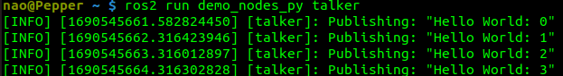
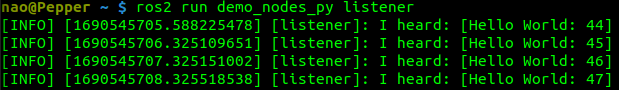
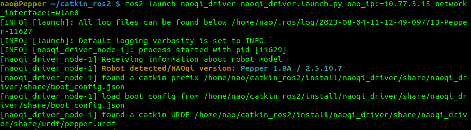
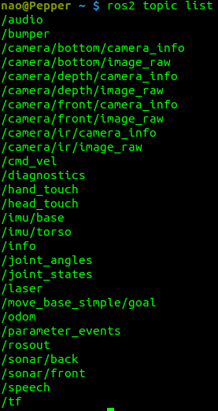

# pepper_os_humble

Docker with ROS2 Humble and naoqi_driver2 for Pepper 2.5.

- [pepper\_os\_humble](#pepper_os_humble)
  - [Recommendation](#recommendation)
  - [Release](#release)
  - [Build the environment](#build-the-environment)
  - [Compress to lzma](#compress-to-lzma)
  - [Installation on pepper](#installation-on-pepper)
  - [Test ROS2](#test-ros2)
  - [Test naoqi\_driver2](#test-naoqi_driver2)
    - [Start naoqi\_driver2](#start-naoqi_driver2)
    - [Test naoqi\_driver2](#test-naoqi_driver2-1)
  - [Future works](#future-works)

## Recommendation

It is recommended to set Pepper's IP with:

```bash
$ export PEPPER_IP=x.x.x.x #(i.e 169.254.0.0)
```

in the .bash_profile of Pepper or on any computer that will be used to communicate with Pepper.

For clarity and simplification, the documentation assumes that the variable is set.

## Release 

A plug-and-play environment is available at [https://drive.google.com/file/d/1Wj3Xqa_yEeaTU_f9gRh7vU64BUDX61hh/view?usp=sharing](https://drive.google.com/file/d/1Wj3Xqa_yEeaTU_f9gRh7vU64BUDX61hh/view?usp=sharing). From there go to [Installation on pepper](#installation-on-pepper) 

## Build the environment

The environment can be built using the Dockerfile. This requires gentoo_on_tmp.tar.lzma archive in the same directory. This one can be created using: 

```bash
docker run --entrypoint /tmp/gentoo/executeonprefix neaum/gentoo_prefix_32b:latest  "tar -c --lzma -f - -C /tmp gentoo" > ~/gentoo_on_tmp.tar.lzma
```

Here we are using a 32b version of gentoo prefix build in 11/2023 that is a snapshot of the current gentoo tree at this time. For a more up-to-date version, please consider rebuilding the prefix from scratch using scripts [in dedicated folder](gentoo_prefix_32b/).

## Compress to lzma

Compressing the environment to lzma is necessary as Pepper has limited resources. The entire environment is about ~8GB and will be reduced to about ~1.9GB. In comparison, Pepper has about 25GB of space available.

```bash
$ docker run -it pepper_os_humble:latest

#Outside docker in another terminal
$ docker cp CONTAINER_ID:/tmp/pepper_os.tar.lzma ./pepper_os_humble_32b.tar.lzma 
```

CONTAINER_ID being the ID of the running container (nao@CONTAINER_ID)


## Installation on pepper

First, check whether there is enough space available on Pepper to install the archive.

```bash
$ ssh nao@$PEPPER_IP
$ df -t ext3
```

The archive requires ~8GB to be copied and uncompressed.

Once there is enough space available, the archive can be copied and uncompressed safely. 

```bash
$ scp pepper_os.tar.lzma nao@$PEPPER_IP:/home/nao/
$ ssh nao@$PEPPER_IP
$ tar --lzma -xvf ./pepper_os.tar.lzma
$ rm pepper_os.tar.lzma
```

## Test ROS2

ROS2 can be tested with the following commands:

```bash
$ ssh nao@$PEPPER_IP
$ ros2 run demo_nodes_cpp talker
#The terminal should display: 'Publishing: "Hello world: x"'
```



2nd terminal
```bash
$ ssh nao@$PEPPER_IP
$ ros2 run demo_nodes_cpp listener
#The terminal should display: 'I heard: [Hello world: x]'
```



The python equivalent can be tested with demo_nodes_py instead of demo_nodes_cpp.

## Test naoqi_driver2

### Start naoqi_driver2

```bash
$ ssh nao@$PEPPER_IP
$ ros2 launch naoqi_driver naoqi_driver.launch.py nao_ip:=$PEPPER_IP network_interface:=MACHINE_INTERFACE
```

MACHINE_INTERFACE should be 'wlan0' if Pepper is on wifi or 'eth0' if Pepper connected directly via an ethernet cable.

Alternatively, an alias has been made in .bash_profile

```bash
$ nao_driver
```

The ip and network interfaces will be automatically fetched. 



### Test naoqi_driver2

```bash
$ ssh nao@$PEPPER_IP
$ ros2 topic list
```
Will return a list of all the topic available.



```bash
#On a computer
$ source /opt/ros/humble/setup.bash
$ export ROS_MASTER_URI=http://$PEPPER_IP:11311
$ rviz2 rviz
```

To start rviz2 and display the topic of interest (Add -> By topic).